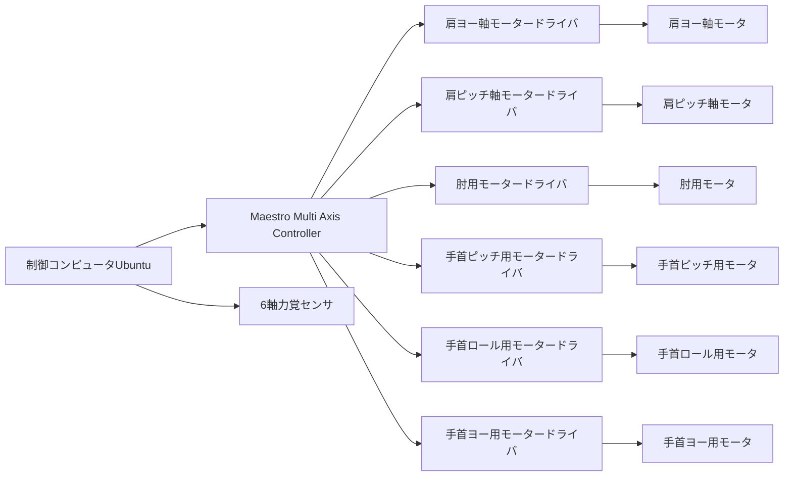

# ロボットアームの全体構造

このページでは、６軸ロボットアーム全体構造と個々の部品について説明する

| |画像|型番など | 個数| 備考|
| --- | --- | --- | --- | --- |
| 関節モータ| | LAC16D04 3 MDH(12) 40E | 3| 肘関節より先の部分 |
| 関節モータ | | LAC17E03 3 MD 4018 20B | 3| 肘関節より根本の部分 |
| 制御基盤(モータドライバ) | | MAN-G-SOLTWIIG 5002 | 6| |
| ６軸力覚センサ |  | LeptrinoのPFSシリーズ | 1| エンドエフェクタにつけられたフォーストルクセンサ|
| 制御コンピュータ |||1|C++のコードによってUDP通信でモータドライバと接続し、関節の情報を読み取ったり関節トルクの情報を送ったりしている|
| モータードライバ制御モジュール |(灰色の) |Maestro Multi Axis Controller |1|制御PCから送られてきた信号をそれぞれのモータドライバにつなげる|

> [!WARNING]
>
> 肘関節より先のモータの型番は変更しているかも。初期位置合わせをしにくかったのでアブソリュート方式のものに変更してもらっている。

## 2. 各部説明

### Maestro Multi Axis Controller　（以下Maestro）

- データシート: // TODO:
- 全てのモータドライバとEtherCAT通信しており、各モータドライバに目標位置やトルクなどの指令を送ったり、モータの状態（出力トルクや角度など）の情報を取得することができる。
  - Maestro専用のAPIが用意されておりそれを使用し、CやC++でプログラミングを行う
  - または、専用の言語？で開発も行うこともできるが、変数名を全てGUIで登録したりしないといけなくて大変なのでやっていない
  - 
- また、制御PCとModbus通信するAPIも用意されており、PCから送られてきた指令をモータードライバに伝えたりできる

### 制御PC

- Ubuntuで開発していたが、Maestroとの通信に使う[libmodbus](https://github.com/stephane/libmodbus)が使えるOSであればなんでも良い

### モータドライバ
- データシート
- Elmoのめっちゃ高性能なやつ。Maxon等の他のモータと比べても圧倒的な性能がある
- MaestroとEtherCATで通信する

概要 †

    WindowsPCとモータドライバを接続して設定、ゲインチューニング、テスト、プログラミングなどが可能
    会員登録さえすれば以下でDL可能
        https://www.elmomc.com/products/application-studio/easii/download-easii/
    接続方法はRS-232、CAN、USB、EtherCAT、UDP
        CANはCANモデルのみでKvaser社のCANインタフェースが必要
            RS-232と違って複数のモータドライバを一度に扱えて便利だが、結構高い。恐らくLeaf Light HS v2をChip 1 stopで買うのが最安(2018/11/11現在\32,500)
            https://www.chip1stop.com/product/detail?partId=KVAS-0000072&mpn=KVASER+LEAF+LIGHT+V2
            初期設定ではBaudRate500、NodeID127になってる
        USB、EtherCAT、UDPはEtherCATモデルのみ
        RS-232はPCとGNDが接地されていないと壊れる場合があるので注意
    DriveProgrammingは結構遅い。普通にPID制御を組むだけで2ms周期程度になる。

